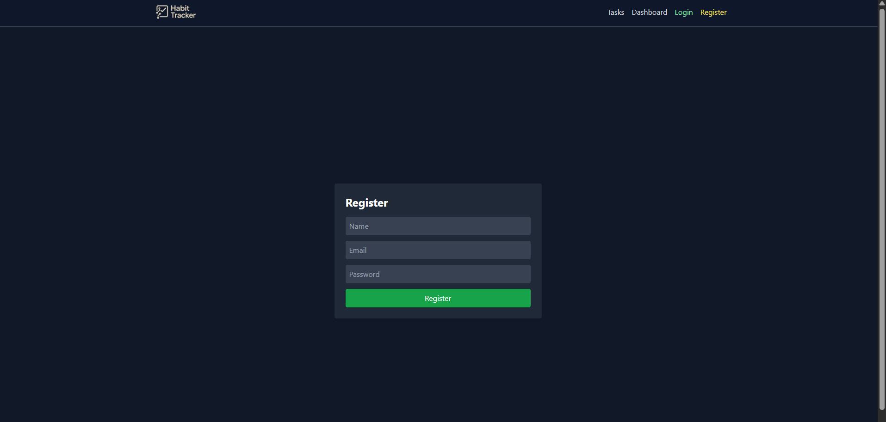
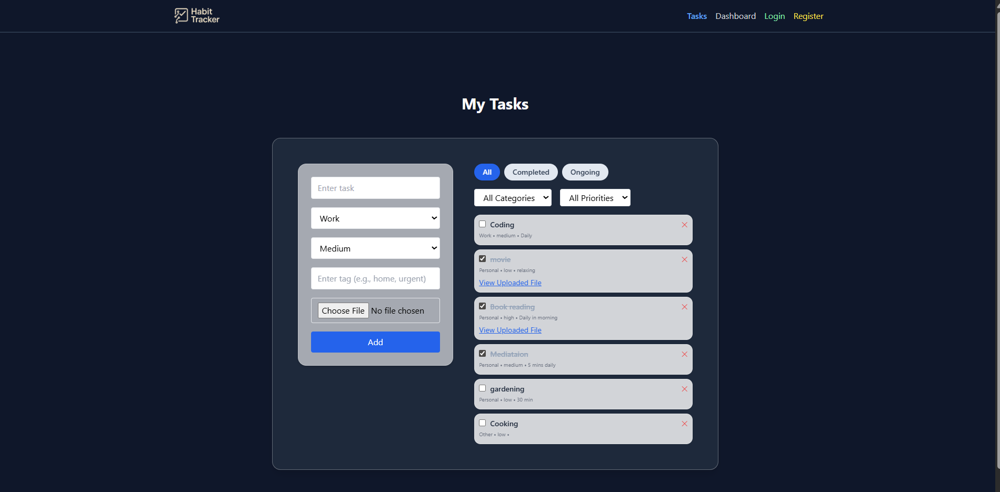
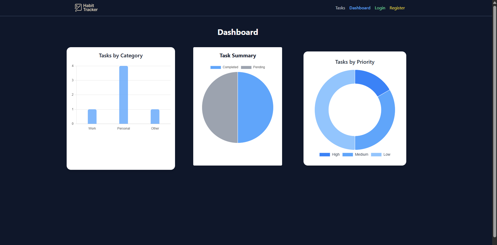

# ✅ To-Do Web Project – Habit Tracker

A beautifully designed habit-tracking web app with authentication, task filtering, file uploads, and visual charts for productivity insights. Built using **React**, **Tailwind CSS**, **Node.js**, **Express**, and **MongoDB**.

## 🚀 Features

- ✅ User **Login / Registration**
- 📅 Add **Tasks** with:
  - Category, Priority, Tags
  - File Uploads (optional)
- 🧠 Filter tasks by:
  - Category, Priority, Completion
- 📊 **Dashboard** with charts:
  - Tasks by Category
  - Tasks by Priority
  - Completion Summary
- 🎨 Clean modern UI (Glassmorphism + Dark mode)

## 🖼️ Habit Tracker Overview

> Auth Pages  
> 

> Task Manager  
> 

> Dashboard  
> 

## ⚙️ Tech Stack

| Frontend      | Backend    | Database | Styling       | Charts   | Tool / Service |
| ------------- | ---------- | -------- | ------------- | -------- | -------------- |
| React + TS    | Node.js    | MongoDB  | Tailwind CSS  | Chart.js | Bruno          |
| Framer Motion | Express.js |          | Glassmorphism |          |
|               | Multer     |          |               |          |
